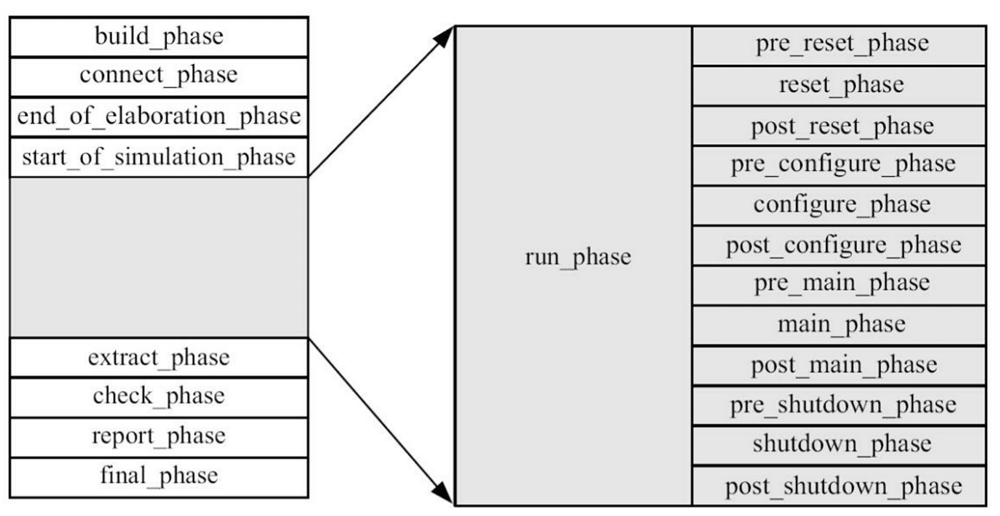

> 备注：本文档主要参考了张强的《UVM实战》一书，并依赖UVM_lib源码和一些基础的systemverilog知识，旨在深入学习UVM Phase机制的特点和实现思路。

## phase 机制

### 1. phase 分类

按照是否消耗仿真时间来分类，phase的默认执行顺序如下图所示：



其实，对于phase的执行流程，我们可以总结为以下几个步骤：

1. **初始化阶段**：build_phase → connect_phase → end_of_elaboration_phase → start_of_simulation_phase
2. **运行阶段**：run_phase（或Run-time Phases）
3. **收尾阶段**：extract_phase → check_phase → report_phase → final_phase

其实，初始化阶段中最常用的就是build_phase和connect_phase。分别用于构建组件树和连接组件。而收尾阶段最常用的是check_phase和report_phase。分别用于检查UVM组件的状态是否结束和生成测试报告。

把run_phase切割成多个子phase，很容易看出每个子phase从名称上都能看出来对应的功能是什么。pre、post本质是钩子函数，用于在phase执行前后添加自定义的行为。经常使用的reset、configure、main、shutdown这几个对应芯片典型工作阶段：上电->配置->运行->停止工作。

### 2. 层次化执行顺序总结

>备注：可能和版本有关，不同版本的UVM可能会有 slightly different default phase order.

1. build_phase\final_phase 自上而下，其余function_phase均为自下而上
2. build_phase按照**深度优先**原则构建
3. task_phase 本质上是在一个时间片内同时启动

## domain 机制

domain 机制个人理解对应于**设计的时钟域**的概念。类似于设计中会在架构上划分根据设计特性划分出不同时钟域，UVM中也可以针对不同的UVM组件定义不同的时钟域。独立domain下的phase都是独立执行的。不过在实际工作中因工作内容的原因不太需要此机制，因此一直没有使用过domain机制，所以个人理解可能有误。

uvm 的 common_domain 也是单例的，所有的UVM组件默认都属于common_domain。

如果想声明一个新的domain，需要继承uvm_domain类。如下面这样:

```systemverilog
class B extends uvm_component;
  uvm_domain new_domain;
  `uvm_component_utils(B)

  function new(string name, uvm_component parent);
    super.new(name, parent);
    new_domain = new("new_domain");
  endfunction

  virtual function void connect_phase(uvm_phase phase);
    set_domain(new_domain);
  endfunction
  ...
endclass
```

## 代码实现

实现phase机制和domain机制主要的类如下表所示:

```txt
uvm_phase (基类)
├── uvm_topdown_phase (自顶向下执行)
│   └── uvm_build_phase, uvm_final_phase
├── uvm_bottomup_phase (自下而上执行)
│   └── uvm_connect_phase, uvm_end_of_elaboration_phase ...
└── uvm_task_phase (任务型Phase，支持objection)
    └── uvm_run_phase, uvm_pre_reset_phase, uvm_reset_phase ...
uvm_phase_hopper (用于遍历phase)
uvm_domain (用于定义domain)
```

本质上，phase的执行流程是**递归遍历组件树的过程**。我们知道，所有UVM组件都继承自uvm_component，而uvm_component中定义了phase的接口和m_current_phase, m_domain。其中m_current_phase用于记录当前正在执行的phase，而m_domain则用于记录当前组件所属的domain。

实际启动流程:

1. uvm_root run_test启动仿真，调用 单例的uvm_phase_hopper

    ```systemverilog
    fork 
      begin
        // spawn the phase runner task
        uvm_phase_hopper hopper;
        hopper = uvm_phase_hopper::get_global_hopper();
        m_uvm_core_state.push_front(UVM_CORE_RUNNING);
        hopper.run_phases();
      end
    join
    ```

2. uvm_phase_hopper 核心代码逻辑如下，此段代码的功能是获取domain中的所有phase，并按顺序执行这些phase(pricess_phase函数)

    ```systemverilog
    task uvm_phase_hopper::run_phases();
      // initiate by starting first phase in common domain
      uvm_phase ph;
      ph = uvm_domain::get_common_domain();
      schedule_phase(ph);

      fork
        begin
          forever begin
            this.get(ph);
            fork
              automatic uvm_phase phase = ph;
              begin
                this.process_phase(phase);
                drop_objection(phase, "phase done"); // raised in try_put
              end
            join_none
          end
        end
      join_none

      wait_for_objection(UVM_ALL_DROPPED);
    endtask : run_phases
    ```

3. 其中，uvm_phase 以及 build、connect、run、final 等phase都是单例的。它们会添加到uvm_domain::common_domain中。根据树形结构 + uvm_componet 的 m_current_phase, 各单例的phase 组件按照特定顺序执行。

## objection 机制

objection机制的作用是用于等待所有组件完成当前task_phase的执行。如果在phase执行过程中，有组件调用了raise_objection函数，那么uvm_phase_hopper 会等待所有组件调用drop_objection函数后，才会继续执行下一个phase。

其中，最主要的组件是 uvm_objection。它的工作原理是维护一个引用计数。当组件调用raise_objection函数时，引用计数加1；当组件调用drop_objection函数时，引用计数减1。如果引用计数为0，那么uvm_phase_hopper 会认为所有组件都完成了当前phase的执行，继续执行下一个phase。

## uvm_root.run_test()方法

作为uvm仿真入口的方法，其主要功能如下：

1. **初始化准备**：
   1. 执行预测试回调
   2. 初始化objection机制
   3. 解析命令行参数
2. **测试组件创建**：通过factory创建测试组件（uvm_test_top），检查组件存在性
   1. 创建测试组件（uvm_test_top）
   2. 检查测试组件是否存在并打印日志
3. **Phase执行**：启动Phase Hopper执行所有Phase，按**DAG顺序**管理Phase执行
4. **测试结束**：
   1. 执行后测试回调
   2. 命令行检查
   3. 报告汇总
   4. 测试完成，调用 uvm_top.final_phase() 结束仿真

## advance topic

1. phase 的跳转
   1. 可以在phase执行过程中，通过调用phase的jump_phase()方法，跳转到指定的phase。
2. phase 调试
   1. 仿真命令行增加 +UVM_PHASE_TRACE，即可打印出每个phase的执行信息。
3. 仿真的超时退出
   1. 设置仿真超时时间，通常建议使用命令行模式设置，如 +UVM_TIMEOUT=1000000000，NO/YES
4. objection 的控制方式建议
   1. 建议只在sequence中使用，借助 starting_phase 的raise_objection和drop_objection方法来控制objection。
   2. starting_phase 是uvm_sequence基类中的一个成员变量，用于记录当前sequence所属的phase。
   3. 使用时避免因为sequence的嵌套导致出现多次raise or drop。尽量旨在base_virtual_sequence中的pre_body中使用。
5. objection 的调试
   1. 仿真命令行增加 +UVM_OBJECTION_TRACE，即可打印出每个objection的变化信息。
6. objection 的超时退出
   1. 设置objection超时时间,使用 phase.phase_done成员变量的set_drain_time() 方法，在撤销objection时设置仿真延迟时间。
