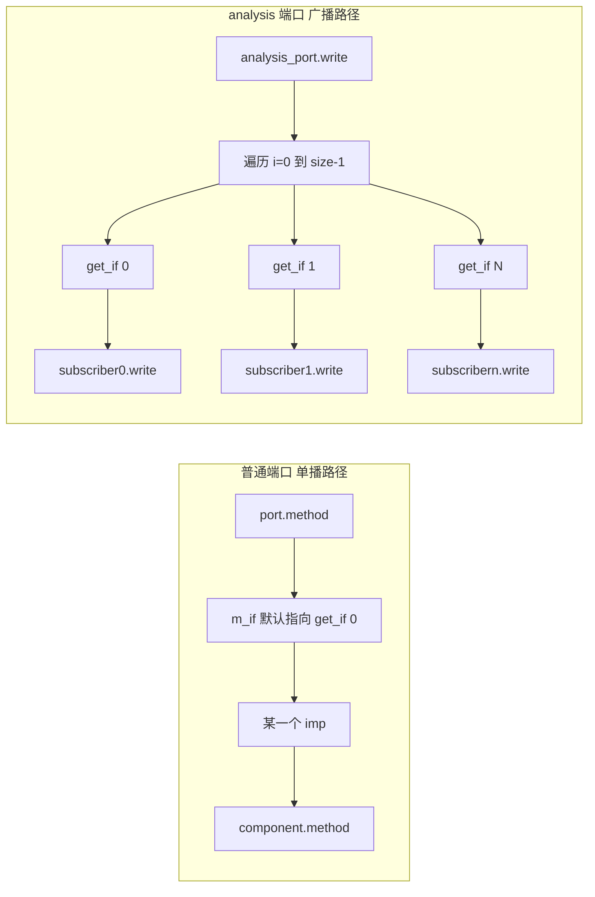
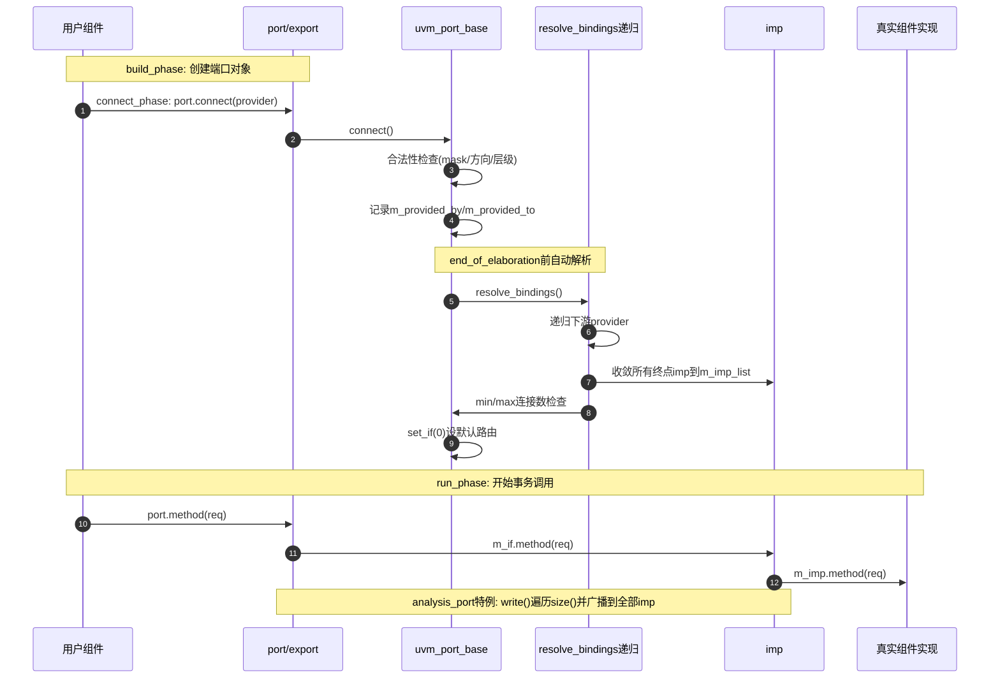

# TLM1.0 端口

> 本文档基于 UVM 1800.2-2020.3.1 的源码整理，重点分析 `src/tlm1/` 与 `src/base/uvm_port_base.svh` 中 TLM1 端口机制的实现原理。

TLM 是 Transaction Level Modeling（事务级建模）的缩写。UVM TLM1 里最核心的一点是：

- **所有 port / export / imp 最终都归一到 `uvm_port_base#(IF)` 这套连接与解析机制**
- **各类 put/get/peek/transport 端口只是“接口能力不同”的模板化派生类**

---

## 1. 本质：端口系统在解决什么问题

UVM 端口系统本质在做三件事：

1. **连接建图**：在 `connect_phase` 期间把端口之间的连接关系保存下来（谁连到了谁）
2. **连接收敛**：在 end_of_elaboration 前统一递归解析，得到最终 imp 终点列表
3. **调用分发**：运行期调用端口方法时，把请求转发到默认 imp（普通端口）或所有 imp（analysis 端口）

可以把它理解成：

- `connect()` 只是在“登记连接关系”
- `resolve_bindings()` 才是在“把关系图压平为可调用目标列表”

---

## 2. 代码入口与分层

### 2.1 基类层（连接与解析核心）

- `src/base/uvm_port_base.svh`

`uvm_port_base#(IF)` 负责：

- 连接合法性检查（类型、方向、层级关系）
- 维护 fanout / fanin 图
- 递归解析得到最终 imp 列表
- 连接数量约束检查（min/max）

### 2.2 接口能力层（TLM1 接口定义）

- `src/tlm1/uvm_tlm_ifs.svh`

定义 `uvm_tlm_if_base#(T1,T2)`，里面声明 put/get/peek/transport/write 等接口方法。所有端口最终都以这个 IF 类型为参数实例化。

### 2.3 模板生成层（端口族批量定义）

- `src/tlm1/uvm_tlm_imps.svh`
- `src/tlm1/uvm_ports.svh`
- `src/tlm1/uvm_exports.svh`
- `src/tlm1/uvm_imps.svh`

这里通过宏把“new + 类型名 + 接口转发函数”批量生成出来，避免手写大量重复样板代码。

### 2.4 analysis 特例层（广播模型）

- `src/tlm1/uvm_analysis_port.svh`

analysis 是单独实现的一套广播语义：`write()` 会遍历全部连接终点，不走“单默认通道”语义。

---

## 3. 类型体系与继承关系

典型单向端口（例如 `uvm_blocking_put_port#(T)`）都长这样：

```systemverilog
class uvm_blocking_put_port #(type T=int)
  extends uvm_port_base #(uvm_tlm_if_base #(T,T));
  `UVM_PORT_COMMON(`UVM_TLM_BLOCKING_PUT_MASK,"uvm_blocking_put_port")
  `UVM_BLOCKING_PUT_IMP (this.m_if, T, t)
endclass
```

关键点：

- 统一继承 `uvm_port_base#(uvm_tlm_if_base#(...))`
- 用掩码 `m_if_mask` 标记它支持/需要的接口能力
- 用宏生成实际调用函数，函数体一般转发到 `this.m_if`

imp 类则通过 `UVM_IMP_COMMON` 持有 `m_imp`（真实实现者对象），最终把接口调用转给组件内的实现函数。

---

## 4. 宏机制：为什么能批量定义几十种端口

在 `uvm_tlm_imps.svh` 中，三个核心宏是：

- `UVM_PORT_COMMON`
- `UVM_EXPORT_COMMON`
- `UVM_IMP_COMMON`

它们做的事非常统一：

1. 生成构造函数 `new(...)`
2. 在 `super.new(...)` 中标记端口类型（`UVM_PORT/UVM_EXPORT/UVM_IMPLEMENTATION`）
3. 设定 `m_if_mask`
4. 生成 `get_type_name()`

也就是说：

- put/get/peek/transport 的“类名差异”本质上是**掩码 + 接口函数组合差异**
- 连接、解析、错误检查逻辑并没有散落在每个类里，而是被基类统一托管

---

## 5. 连接阶段：connect() 到底记录了什么

`uvm_port_base::connect(provider)` 在逻辑上分四步。

### 5.1 时机保护

如果已经到 end_of_elaboration 执行中或之后，再调用 connect 会报警并忽略（Late Connection）。

### 5.2 基础合法性检查

- provider 不能是 null
- 不能把端口连到自己
- provider 的接口能力必须覆盖 requirer 的需求：
    - 判定公式：`(provider.m_if_mask & this.m_if_mask) == this.m_if_mask`

### 5.3 端口类型方向检查

- imp 不能主动 `connect()`（imp 是构造时就绑定实现者）
- export 不能连到 port（应该反过来由 port 连 export）

### 5.4 层级关系检查

`m_check_relationship()` 默认检查层级方向：

- port->port：子连父
- port->export/imp：兄弟层级
- export->export/imp：父连子

但 `uvm_analysis_port` 特判为放开层级限制（允许跨层广播连接）。

通过检查后，连接关系被存入两个表：

- `m_provided_by`：我连到了谁（fanout）
- `provider.m_provided_to`：谁连到了我（fanin）

注意：此时还没形成最终 imp 列表。

---

## 6. 解析阶段：resolve_bindings() 如何收敛到 imp

`resolve_bindings()` 会在 end_of_elaboration 前自动触发，核心目标是把连接图递归压平。

流程如下：

1. 若已解析（`m_resolved`），直接返回，避免重复递归
2. 若当前节点是 imp：把自己加入 `m_imp_list`
3. 若当前是 port/export：

- 对每个 `m_provided_by` 下游先递归 `resolve_bindings()`
- 再通过 `m_add_list()` 把下游的 imp 列表并入本节点 `m_imp_list`

1. 做数量检查：

- `size() < min_size()` 报错
- `size() > max_size()`（非 unbounded）报错

1. 若有连接，默认 `set_if(0)`，建立默认转发目标

这一步完成后：

- `size()` 才是有效值
- `get_if(index)` 才能拿到稳定可用的 imp

---

## 7. 调用阶段：运行期函数怎么走到最终实现

### 7.1 普通 port/export（单默认通道）

以 put/get/peek/transport 类为代表，函数通常由宏生成并调用 `this.m_if.xxx(...)`。

- `m_if` 是 `set_if(default_index)` 选中的默认 imp 接口
- 默认是 index=0，可通过 `set_default_index()` 改默认路由

这就是“多个实现可连，但默认只走一个实现端点”的语义。

### 7.2 imp（终点调用）

imp 类持有 `m_imp`（组件对象），接口函数内直接调用 `m_imp.xxx(...)`。

所以调用链可以概括为：

`port.method -> m_if.method -> imp.method -> component.method`

---

## 8. analysis 端口特例：广播而非单播

`uvm_analysis_port` 与 `uvm_analysis_export` 都显式实现了 `write(T t)`：

- 遍历 `for (int i = 0; i < size(); i++)`
- 对每个 `get_if(i)` 调 `tif.write(t)`
- 任一接口为空会直接 fatal

这说明 analysis 端口是“天然广播语义”，并非普通 port 那套“默认 index 单播语义”。

同时，关系检查中对 analysis 端口放宽层级限制，也体现了其用于全局观测/订阅的定位。

可以用下面这张对照图快速记忆两者差异：



一句话记忆：

- **普通 port/export 解析出多个 imp 后，默认只选一个 m_if 来调用**
- **analysis port 则会遍历全部 imp，逐个执行 write()**

---

## 9. 从 connect_phase 到 run_phase 的完整时序

可以用下面的时序理解端口系统：

1. `build_phase`：组件与端口对象被创建
2. `connect_phase`：用户调用各种 `port.connect(...)`
3. end_of_elaboration 前：框架调用 `resolve_bindings()`
4. end_of_elaboration 之后：

- 可安全 `size()/get_if()`
- 运行期调用开始稳定转发

复习速记可以直接看这张“连接解析时序图”：



因此，很多“端口没连上”问题，本质都能在 end_of_elaboration 处暴露。

---

## 10. 调试与排障要点

`uvm_port_base` 已内建几组很实用的方法：

- `debug_connected_to()`：打印 fanout 网络
- `debug_provided_to()`：打印 fanin 网络
- `get_connected_to()` / `get_provided_to()`：程序化拿连接表

常见错误定位建议：

1. 先看 connect 时是否触发 connection error/warning
2. 再看 end_of_elaboration 的 min/max 连接数错误
3. 对 analysis 的 `write()` fatal，优先检查是否存在空连接终点

---

## 11. 总结

UVM TLM1 端口实现可以浓缩成一句话：

- **用宏批量生成“接口外观”，用 `uvm_port_base` 统一承接“连接图管理与绑定解析”，再在运行期按默认路由或广播语义完成方法分发。**

所以在阅读和调试时，建议始终分三层看：

1. 这个端口类需要什么接口能力（`m_if_mask`）
2. 连接图在解析后收敛到了哪些 imp（`m_imp_list`）
3. 运行期调用是默认单播还是 analysis 广播

只要这三层想清楚，TLM1 端口的大多数行为都能准确预判。
