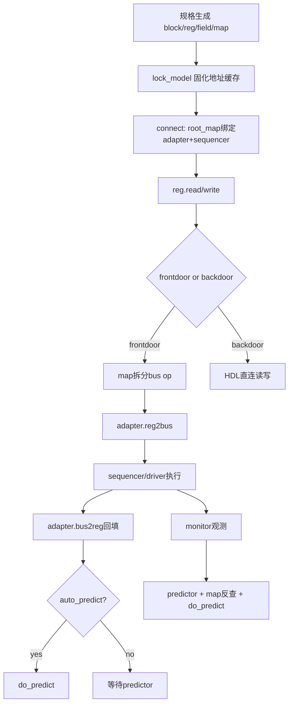

## 寄存器模型机制（全局视角）

> 备注：本文基于 UVM 1800.2-2020.3.1 的 reg 源码整理，覆盖 uvm_reg_block、uvm_reg、uvm_reg_field、uvm_mem、uvm_reg_map、uvm_reg_adapter、uvm_reg_predictor 等核心对象。目标是从“寄存器模型整体系统”而非单一 regmap 来理解实现机制。

---

## 1. 本质：RAL 在解决什么问题

寄存器模型（RAL）的核心目标不是“发一次总线读写”，而是把下面几件事统一起来：

1. 寄存器规格抽象（字段、访问属性、reset、覆盖率）
2. 多层次地址组织（block/sub-block、多 map 视角）
3. 前门/后门访问执行
4. mirror/desired 状态维护与一致性检查
5. 与总线协议解耦（adapter）
6. 被动观测预测（predictor）

一句话概括：

- **RAL 是“规格模型 + 地址模型 + 访问执行 + 状态预测”的一体化框架。**

---

## 2. 对象分层：谁负责什么

### 2.1 规格层对象

- `uvm_reg_block`：寄存器层次容器，管理 block/map/lock
- `uvm_reg`：寄存器对象，管理字段、读写流程、mirror/desired
- `uvm_reg_field`：字段语义（RO/RW/W1C/RC 等）
- `uvm_mem`：大容量数组式存储抽象

### 2.2 地址层对象

- `uvm_reg_map`：把 reg/mem/submap 映射到总线地址空间
- 多 map 支持：同一寄存器可存在 APB/AHB/CPU 等多访问视角

### 2.3 执行层对象

- `uvm_reg_adapter`：`uvm_reg_bus_op` 与 bus item 互转
- `sequencer/driver`：真正驱动总线事务
- user frontdoor：特殊访问流程定制

### 2.4 预测层对象

- auto_predict：主动访问后立即预测
- `uvm_reg_predictor`：基于 monitor 观测被动预测

---

## 3. 生命周期：从建模到运行

### 3.1 建模期（build 前后）

1. `block.configure()`
2. `create_map()`
3. `add_reg()/add_mem()/add_submap()`
4. `set_default_map()`

这一阶段主要是“声明关系”，并未形成稳定物理地址缓存。

### 3.2 固化期（lock_model）

`lock_model()` 会触发地址模型固化：

- 递归展开 map 树
- 计算 reg/mem 物理地址
- 建立 `offset -> reg/mem` 查找缓存
- 支持 `get_reg_by_offset()/get_mem_by_offset()`

结论：

- **没 lock 的模型，不应做依赖地址解析的操作。**

### 3.3 运行期（connect/run）

1. root map 绑定 `set_sequencer(adapter)`
2. reg read/write 选择 local_map/root_map
3. 前门路径发起总线访问
4. 预测路径更新 mirror

---

## 4. 访问主线：一次 read/write 发生了什么

### 4.1 入口在 `uvm_reg::do_read/do_write`

- 校验访问合法性
- 处理字段/寄存器回调
- 决定 `UVM_FRONTDOOR` 还是 `UVM_BACKDOOR`

### 4.2 前门路径（默认主路径）

- 先确定 local_map（地址解释上下文）
- root_map 提供 adapter + sequencer（执行上下文）
- `uvm_reg_map::do_bus_access()` 拆分成若干 `uvm_reg_bus_op`
- adapter 转换成具体 bus item 并执行
- 读操作回拼数据到抽象寄存器值

### 4.3 后门路径

- 直接通过 HDL/backdoor 访问，不走总线
- 常用于快速初始化、状态探测、难以前门访问场景

---

## 5. regmap 在全局中的定位

regmap 是最重要的“中间编排层”。

职责：

1. 地址翻译（local -> physical）
2. beat 切分（宽寄存器跨总线宽度）
3. endian 处理
4. offset 反查（给 predictor 用）
5. **frontdoor 访问（读写）**的数据搬运编排

在实际工作中，通常存在多个regmap，这通常意味着同一套寄存器对象，在不同总线接口下有的不同地址/访问方式。

---

## 6. adapter 机制：协议解耦层

`uvm_reg_adapter` 必须实现：

1. `reg2bus()`：抽象 bus op -> 协议 transaction
2. `bus2reg()`：协议 transaction -> 抽象 bus op

设计要点：

- byte enable 映射正确
- status/data 回填完整
- 区分 request/response 模式（`provides_responses`）
- 必要时配置 `parent_sequence`

实践建议：

- adapter 单独做**单元验证**，减少 RAL 联调成本
- VIP中，一般非片内总线不会提供adapter，需要手动编写，此时一般需要置 provides_responses 为 1
- 对于特殊的driver，依赖特定的sequence时，需设置parent_sequence，但似乎实际用不到

---

## 7. frontdoor 机制：特殊访问流程插拔点

当 `map_info.frontdoor != null` 时，寄存器访问优先走 user frontdoor。

适用场景：

1. 间接寄存器（index/data）
2. 访问前需要握手或模式切换
3. 安全窗口、页切换、bank 选择等流程

策略建议：

- 默认寄存器走 built-in frontdoor + adapter
- 仅特殊寄存器挂 user frontdoor
- user frontdoor 尽量复用标准序列路径，避免体系割裂

---

## 8. predictor 机制：观测驱动的镜像更新

`uvm_reg_predictor` 路径：

1. monitor bus item -> predictor.bus_in
2. adapter `bus2reg()` 转抽象 op
3. map 按地址反查寄存器
4. 多 beat 聚合后 `do_predict()`
5. 更新 mirror 并可输出 reg_ap

重点：

- predictor 依赖 map + adapter 与监测总线一致
- 默认实现主要针对 reg（非 mem）
- 对读可结合 `check_on_read` 做一致性检查

---

## 9. auto_predict vs predictor

- auto_predict：主动访问后即时更新，配置简单
- predictor：被动观测更新，更贴近真实硬件行为

推荐优先级：

1. 有 monitor 且追求真实性：优先 predictor
2. 快速 bring-up：可先开 auto_predict
3. 两者同时开：需明确分域，避免重复预测

---

## 10. 寄存器模型生成策略（工程落地）

### 10.1 三层生成策略

1. 规格源（Excel/IP-XACT/SystemRDL/YAML）
2. auto 生成层（可重生）
3. user 扩展层（禁止覆盖）

### 10.2 建议边界

- auto 层：block/reg/field、map 定义、add_reg/add_mem
- user 层：frontdoor、回调、特例预测、自定义检查

### 10.3 流程建议

1. 从规格自动生成模型
2. build 后 lock_model
3. connect 绑定 adapter + sequencer
4. run 期间通过 predictor/auto_predict 维护镜像
5. 回归加地址一致性与访问一致性检查

---

## 11. 全局执行链路图（速记）

---

## 12. 总结

从全局看，寄存器模型机制可以记成四层协作：

1. **规格层**：reg/field/mem/block
2. **地址层**：map（含多视角与层次换算）
3. **执行层**：frontdoor/backdoor + adapter + sequencer
4. **状态层**：auto_predict/predictor + mirror/check

所以真正的设计重点不是“把 regmap 写全”，而是：

- **让这四层职责边界清晰、配置一致、验证闭环完整。**
