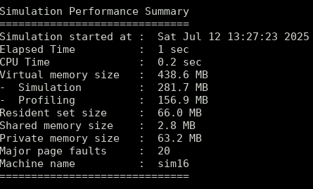

# VCS工具的仿真资源分析（1）

> 来源：<https://www.cnblogs.com/cmyxjcc/p/18980436>
> 说明：按原文风格整理，保留“从现象到资源概念”的分析路径。

在使用 VCS 做回归时，如果某些 case 突然变慢，或者机器上内存吃得很厉害，第一步不一定是改代码，而是先看清楚仿真到底把资源花在了哪里。

`-reportstats` 就是一个非常轻量、但很实用的入口。

## 1. -reportstats 及报告信息分析

使用方式：

```shell
./simv -reportstats [run_options]
```

仿真结束后，统计会输出到终端，并默认写入仿真日志。



常见字段可先这样理解：

- `Elapsed Time`：从启动到结束的挂钟时间。
- `CPU Time`：VCS 派生进程累计用户态 + 内核态 CPU 时间。
- `virtual memory size`：虚拟内存规模。
- `resident set size`：常驻物理内存（RSS）。
- `shared/private memory`：共享/私有内存占用。
- `major page faults`：主缺页次数，通常意味着有磁盘交换开销。

补充经验：

- 主缺页增高不代表仿真失败，但往往会拖慢速度。
- 若同时开启 profiling 相关选项，资源占用会比普通仿真更高。

## 2. 硬盘交换空间（swap space）

当物理内存不够时，系统会把部分页换到磁盘，这就是 swap。

常见两种形态：

- 交换分区（Swap Partition）
    - 优点：访问链路短，性能稳定。
    - 缺点：扩缩容不灵活。
- 交换文件（Swap File）
    - 优点：配置灵活，便于动态调整。
    - 缺点：受文件系统和碎片影响更明显。

如果仿真过程中 major page faults 持续升高，通常要警惕 swap 带来的性能下降。

## 3. 虚拟内存

虚拟内存是操作系统提供的逻辑抽象，它把“进程看到的地址空间”映射到物理内存和磁盘空间。

做 VCS 资源分析时，建议把下面几项连起来看：

- 虚拟内存（virtual）
- 常驻内存（resident）
- 共享/私有内存（shared/private）
- swap 行为（page faults）

只盯一个指标容易误判，组合看趋势更可靠。

## 4. 小结

- `-reportstats` 适合作为第一层快查工具。
- 先判断是时间瓶颈还是内存瓶颈，再决定是否进入 `-simprofile` 深挖。
- 对比分析要保证输入条件一致（case、seed、机器、工具版本）。
