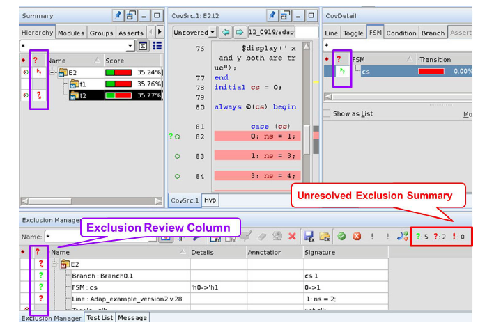
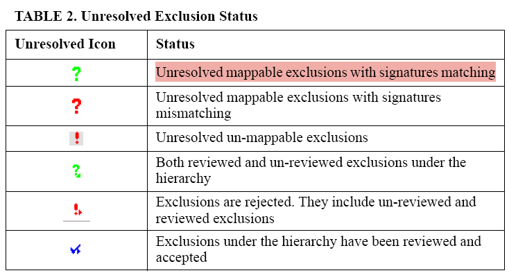

# Verdi 覆盖率豁免避坑指南

> 来源：<https://www.cnblogs.com/cmyxjcc/p/19489535>
> 说明：本文为原文解析整理版，聚焦 Waiver 失效后的高频排障动作。

## 1. Waiver 为什么会失效

典型触发条件：

- RTL 结构调整（层次变动、实例名变化）
- 代码逻辑修改（checksum/signature 改变）
- 旧 `.el` 直接套用新 coverage database

结果：Exclusion Manager 中出现 unresolved 异常项。

## 2. 异常图标识别与处理

常见异常：

- 绿色问号（匹配签名、路径变化）：可 remap，但实务中建议重新 waive 更稳妥。
- 红色问号（签名不匹配）：旧规则不再可信，直接 reject。
- 红色感叹号（不可映射）：原目标已消失或完全变更，直接 reject。

## 3. 最容易踩的“隐形坑”

问题现象：界面看似处理完成，但覆盖率结果不变化。

高频根因：

- 直接覆盖旧 `.el`，实际未落盘（只读文件/路径错误/版本兼容问题）。

推荐动作：

1. 处理完 unresolved 项后，不要直接覆盖旧文件。
2. 使用 `Save As...` 输出新文件（例如 `waivers_v2_fixed.el`）。
3. 回归脚本或 Makefile 显式切换到新 waiver 路径。
4. 失效项数量较大时，按状态筛选后批量 reject，提升处理效率。

## 4. 实操建议

- “迁移复用”优先级低于“重新评估后重建”。
- 将 waiver 文件纳入版本管理，避免人工覆盖丢失。
- 每次 RTL 大改后，先做 unresolved 清理再看 score。

## 5. 一页结论

- 绿色可讨论，红色直接重建。
- `Save As New File` 是保命动作。
- Waiver 不是一次性产物，要随 RTL 演进持续维护。
