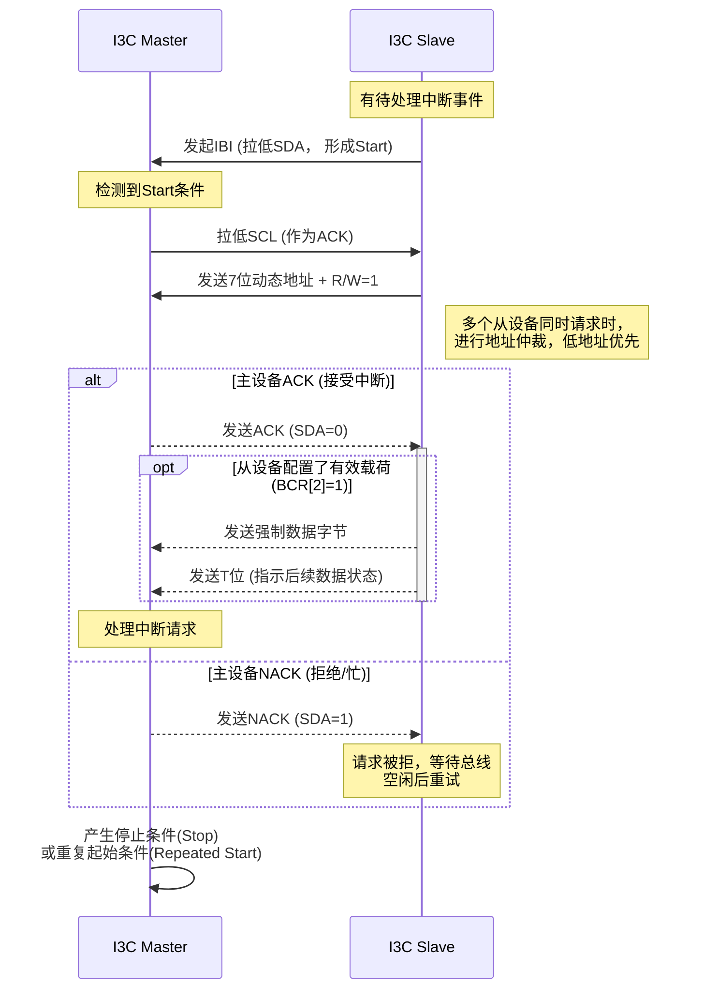

# I3C Slave Pad IBI 时序异常问题复盘

## 1. 问题背景

| 项目 | 内容 |
| --- | --- |
| 涉及模块 | I3C IO Pad / IBI Control Logic |
| 功能场景 | 芯片作为 Slave 向 Master 发起 IBI（In-Band Interrupt） |
| 故障现象 | IBI 启动序列中 SDA 出现 Glitch 或电平异常，Master 识别 ACK 失败，导致仲裁失败或总线挂死 |

## 2. 问题描述

I3C 要求 SDA 在开漏（OD）与推挽（PP）模式之间动态切换。

- 控制信号：`Signal_OD=1` 表示 OD，`Signal_OD=0` 表示 PP。
- 预期时序：先保证 Data/OE 稳定，再切换 PAD 模式。
- 实际时序：`Signal_OD` 提前翻转，早于 Data/OE 稳定。
- 直接后果：驱动能力提前切换，在线路上形成中间态或毛刺。

## 3. 根因分析

### 3.1 技术层面：控制与数据路径失配

PR 后控制路径物理延时小于数据路径，导致竞争暴露。

### 3.2 流程层面：后仿模型与实物脱节

Bug 漏检的核心在于“后仿通过”建立在错误模型上：

1. 前仿局限：零延迟模型无法体现真实路由差异带来的竞争。
2. 后仿失真：Pad 未使用工艺提供网表或提取网表，而是行为级近似模型。
3. 参数失真：延时参数来自口头估算（如固定 `#2ns`），缺少 PVT 波动与路由延时。
4. 结论偏差：得到的是 False Positive 的“通过结果”。

### 3.3 方法闭环缺失

缺少 AMS 验证闭环，本质是在验证“数字逻辑 + 理想化 Pad 模型”，而非真实模数边界。

## 4. 修复与规避

### 4.1 当前版本临时规避

芯片已 Tape-out，无法改金属，只能软件规避：

- 通过寄存器将 IBI 阶段 Pad drive strength 下调至最低档。
- 以降低边沿速率方式减轻毛刺影响。

### 4.2 下版 RTL 修复建议

- 重构 `Signal_OD` 生成逻辑，打拍或状态机约束切换时序。
- 增加 SVA 保护关系：

$$
T_{change\_od} > T_{valid\_data} + T_{setup\_margin}
$$

## 5. 经验与改进

### 5.1 用标准交付替代口头约定

- 模拟团队输出特征化 `.lib`（如 SiliconSmart 产物），纳入数字后端标准流。
- 由 `.lib` + 版图信息生成真实 SDF，替代行为模型中的固定延时。

### 5.2 关键接口引入 AMS 子系统验证

- 对 I3C / DDR / SerDes 等模块，建议搭建小范围 AMS Testbench，不必一开始全芯片 AMS。

### 5.3 完善强度建模

- 对 OD 仲裁场景使用 SystemVerilog 强度模型（如 `strong1`、`pull1`），避免仅以 `X` 粗略覆盖竞争行为。

### 5.4 保留设计余量

- 跨模数边界路径必须保留 Guard Band，不能按理论极限值闭合。

---

## 附：I3C IBI 处理流程

