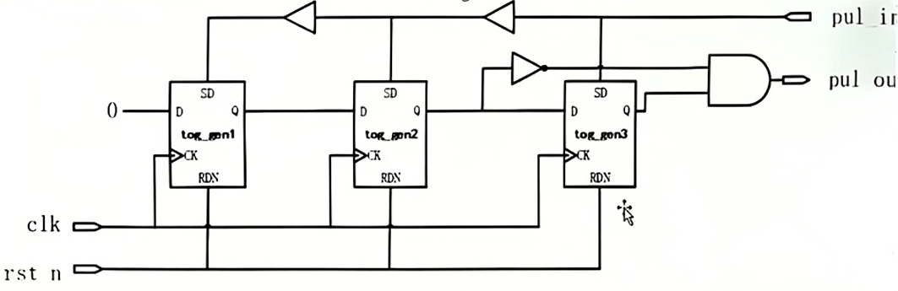

# 跨时钟域同步异常

## 1. 背景与适用范围

| 项目 | 内容 |
| --- | --- |
| 涉及模块 | `fpul2spul` 模块 |
| 功能场景 | 将快时钟脉冲 `pul_in` 同步至慢时钟域 `pul_out`，产生中断 |
| 故障现象 | 异常 WDT（看门狗）中断产生 |

## 2. 问题定义

本问题属于典型的 **跨时钟域同步（CDC）异常**，具体实现代码如下：

```systemverilog
always @(posedge clk or negedge rst_n or posedge pul_in) begin
    if(!rst_n) begin
        tog_gen1 <= 1'b0;
        tog_gen2 <= 1'b0;
        tog_gen3 <= 1'b0;
    end else if (pul_in) begin
        tog_gen1 <= 1'b1;
        tog_gen2 <= 1'b1;
        tog_gen3 <= 1'b1;
    end else begin
        tog_gen1 <= 1'b0;
        tog_gen2 <= tog_gen1;
        tog_gen3 <= tog_gen2;
    end
end

assign pul_out = ~tog_gen2 && tog_gen3;
```

**信号说明**：

- `pul_in`：快时钟域的脉冲信号
- `pul_out`：预期同步到慢时钟域的脉冲信号
- `tog_gen1/2/3`：三级移位寄存器，用于脉冲同步



## 3. 根因分析

### 3.1 同步条件不满足

在特定配置下，快时钟脉冲 `pul_in` 无法满足**连续拉低两个慢时钟周期**的要求，导致三级同步寄存器持续处于置位状态，最终使 `pul_out` 脉冲异常。

### 3.2 毛刺风险

从门级视图可观察到，三级寄存器比二级寄存器**提前置位**，导致 `pul_out` 产生不期望的毛刺（glitch）。

该脉冲同时驱动系统状态机和 `tmr_start` 计数模块。当毛刺与慢时钟上升沿重合时，会**偶发**出现系统状态切换但 `tmr_start` 未启动的问题。

## 4. 修复与规避措施

通过调整电压和扫描参数配置，在一定范围内规避了此问题。

## 5. 落地建议

1. 在设计流程中增加 **CDC 专项评审**环节
2. 在检查清单中添加 **CDC Sign-off** 项
3. 整理跨时钟域使用和检查指南，在部门内推广
