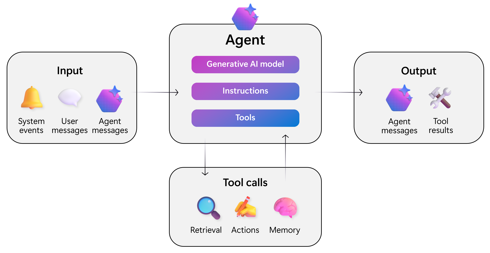
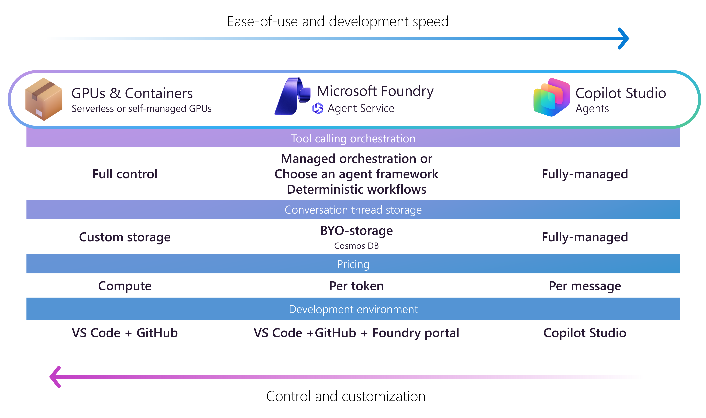

# 智能体概述

## 定义

一个现代的AI agent(智能体或代理)本质是一个灵活的**软件程序**。它使用**生成式大语言模型**来解释输入，如系统事件、用户消息或其他代理消息，推理问题，并决定最合适的行动。与**依赖固定规则的传统应用程序**不同，代理根据实时上下文动态编排工作流。这种适应性使它们能够管理确定性软件无法管理的**模糊性和复杂性**。

- `Generative AI model`(生成式AI模型)用作代理的推理引擎。它处理指令、集成工具调用并生成输出，作为给其他代理的消息或可操作的结果。
- `Instructions`(指令)定义了代理的范围、边界和行为指南。明确的指令可防止范围蔓延并确保代理遵守业务规则。
- `Retrieval`(检索)提供准确响应所需的基础数据和上下文。访问相关的高质量数据对于减少幻觉和确保相关性至关重要。
- `Actions`(动作)是代理用来执行任务的函数、API或系统。工具将代理从被动信息检索器转变为业务流程的主动参与者。
- `Memory`(内存)存储对话历史和状态。内存确保跨交互的连续性，允许代理有效地处理多轮对话和长时间运行的任务。

## 微软智能代理的分型

微软从**业务价值**与**自主程度**两个维度，将企业级AI智能体划分为三类，形成一个从“辅助人”到“替代人”执行复杂流程的能力光谱：

| 智能体类型 | 核心使命 | 关键工具 | 自主权等级 | 典型业务场景 |
| :--- | :--- | :--- | :--- | :--- |
| **生产力代理(`Productivity Agent`)** | **加速决策**：快速整合信息，充当“智能研究助理”。 | 知识工具（如RAG）、信息检索与综合。 | **低**：仅提供信息与建议，不执行操作。 | 客户服务支持、内部知识库问答、市场调研分析。 |
| **行动代理(`Action Agent`)** | **执行任务**：在既定规则下完成具体操作，充当“数字操作员”。 | 知识工具 + 行动工具（调用API、操作软件）。 | **中**：在明确指令和流程内自动执行。 | 自动创建服务工单、会议纪要转待办、系统状态监控与上报。 |
| **自动化代理(`Automation Agent`)** | **管理流程**：端到端自主运行复杂业务流程，充当“全流程管家”。 | 知识工具 + 行动工具 + **智能触发器**（判断、决策、升级）。 | **高**：可自主协调多步骤，并在异常时请求人工干预。 | 供应链优化、自动化安全运维、从订单到现金的完整财务流程。 |

简单理解:

- 生产力代理回答：“情况是什么？” → 基于信息，给你分析和建议。
- 行动代理执行：“去做这件事。” → 根据指令，完成一个或一组动作。
- 自动化代理管理：“全流程交给它。” → 它自己判断何时启动、执行什么、遇到问题怎么办。

能力演进关系:
三者并非互斥，而是**层层递进、相互协同**的关系：

- **自动化代理**是最高形态，其内部通常会**调用多个生产力代理**（进行信息分析与决策支持）和**行动代理**（执行具体操作），来串联成一个完整的、智能的业务流程。
- 一个复杂的**行动代理**，其决策依据可能来源于**生产力代理**提供的信息分析。

实际应用示例：客户投诉处理流程

- **生产力代理**：快速检索客户历史订单、邮件往来、服务记录和相关政策，生成一份客户背景与可能解决方案的报告。
- **行动代理**：根据确定的方案，自动在CRM中创建投诉工单，并通过邮件向客户发送初步回应。
- **自动化代理**：**全程管理**该投诉。它监听投诉渠道，触发***生产力代理***分析问题，然后根据分析结果，指令***行动代理***创建工单、发送回复、甚至发放优惠券。同时，它监控处理时限，若超时未解决，则自动将工单升级给主管。**整个过程仅在启动和需要升级时通知人工。**

这种分类方式清晰地描绘了AI在企业中从“**赋能个体**”（生产力代理），到“**自动化任务**”（行动代理），最终实现“**重塑流程**”（自动化代理）的进化路径。理解这三者的区别与联系，有助于企业在不同场景下选择正确的AI解决方案，并规划其智能化演进路线。

在实际应用中，一个复杂的自动化代理内部，往往会调用多个生产力代理（分析信息）和行动代理（执行具体操作）来协同完成它的目标。

## 市场与产业视角

自2025年，市场研究机构、政府工作报告、还是AI相关产业链的参与者，都认为智能体具有巨大的商业潜力和社会价值，认为是新一轮的生产力革命。

### 产业生态图谱

从产业生态上看，“**AI 四层产业生态图谱**”是一个用于分析和理解人工智能产业价值链的结构化模型。它将复杂的AI产业自上而下或自下而上地划分为四个逻辑层级，每一层代表产业链中一类核心的价值创造环节。**需要注意的是，这个“四层”划分并非唯一标准，在不同语境下（如宏观产业链、大模型生态、智能体生态）的具体分层和命名会有所不同**，但其核心思想都是遵循 **“基础设施 -> 核心技术 -> 平台工具 -> 场景应用”** 的递进关系。

| 层级 | 核心构成 | 功能与角色 |
| :--- | :--- | :--- |
| **基础底座层** | AI芯片/算力、大语言模型、数据服务 | 提供智能体所需的算力、模型能力和数据燃料，是生态基石。 |
| **智能体平台层** | 开发框架与工具链、LLMOps/AgentOps平台、连接器与插件市场 | 连接底层技术与上层应用，是开发者构建和部署智能体的核心阵地。 |
| **通用/行业智能体层** | 通用智能体（如会议助手）、行业智能体（如金融、医疗） | 价值直接变现层，封装具体能力，解决普适或垂直领域的业务流程问题。 |
| **终端用户层** | 个人用户（App/硬件）、企业用户（集成至ERP/CRM） | 最终使用和消费智能体服务的对象。 |

### 四种主流商业模式对比

| 商业模式 | 核心逻辑 | 代表性收费方式 | 代表厂商/产品类型 | 目标客户 |
| :--- | :--- | :--- | :--- | :--- |
| **MaaS** 模型即服务 | **出售“原材料”** 提供最底层的大模型能力，是开发生态的基石。 | 按API调用次数、Token消耗量（输入+输出）计费。 | OpenAI, DeepSeek, 智谱，月之暗面等大模型厂商。 | 所有开发者、企业、平台方，需要模型能力构建上层应用。 |
| **PaaS** 平台即服务 | **出售“厨房与工具”** 提供开发、部署和运营智能体的全套平台与环境。 | 按资源消耗、功能模块或席位收取订阅费/年费。 | Dify, BetterYeahAI等低代码/无代码智能体开发平台。 | 有定制化开发需求、希望私有化部署的企业技术团队。 |
| **SaaS** 软件即服务 | **出售“标准化菜肴”** 将成熟智能体封装成开箱即用的应用，解决特定问题。 | 按用户数、功能模块或使用时长收取订阅费。 | 智能客服Agent、营销内容生成Agent、会议助手等标准化产品。 | 有具体业务需求，但不具备开发能力或希望快速上线的终端企业/个人。 |
| **RaaS** 结果即服务 | **出售“餐饮效果”** 按智能体实际产出的业务价值进行分成，实现风险共担、收益共享。 | 按达成的业务效果（如销售额、节省成本）的一定比例分成。 | 专注于特定行业深度赋能的解决方案商（如销售、财税、设计类Agent）。 | 追求明确投资回报率，愿意与技术服务商深度绑定的企业客户。 |

还是拿微软的商业布局举例：

- **SaaS**：Copilot Studio和Microsoft 365 Copilot等是直接端上桌的菜肴，用户订阅即可使用。
- **PaaS**：Azure AI Foundry是厨房和高级厨具，让企业能根据自己的配方（业务逻辑）烹饪定制化的AI应用。
- **MaaS**：GPU和容器提供最核心的“食材”——大模型能力。

---

## 参考

1. [Microsoft Learn](https://learn.microsoft.com/ka-ge/azure/cloud-adoption-framework/ai-agents/)
2. [China AI 智能体发展报告](https://www.china-aii.com/jgdt/7141377.jhtml)
3. [AI智能体发展报告](https://www.sohu.com/a/790130735_123753)
