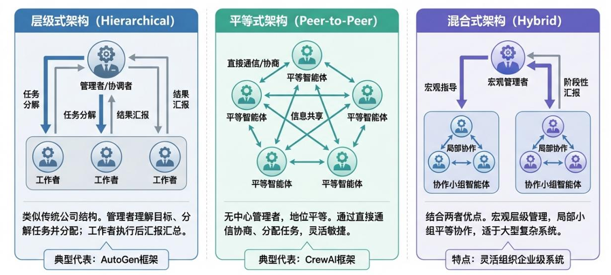

# 智能体原理

现代AI Agent的运行逻辑，本质上是一个持续循环的认知过程：感知环境、进行思考、采取行动、形成记忆，并利用记忆指导下一轮的思考与行动。

## 感知模块

作为Agent的“五官”，负责从内外部环境中捕获信息。它将来自用户指令、文件、数据库、API返回结果，甚至是摄像头和麦克风的原始数据，转化为“大脑”可以理解的结构化信息。

### 多模态信息

现代Agent的信息来源包括但不限于：

- 文本（Text）：用户的自然语言指令、网页内容、文档、代码等。
- 图像（Image）：图表、照片、UI截图、场景图片等。
- 音频（Audio）：语音指令、环境声音、音乐等。
- 视频（Video）：结合了图像和音频的动态信息流。
- 结构化数据：来自API的JSON返回、数据库的表格数据等。

感知模块的首要任务是将这些异构的数据源，通过各自的编码器（Encoder）转换为统一的、高维度的向量表示（Embeddings）。例如，文本通过BERT或类似的Transformer 编码器处理，图像通过ViT（VisionTransformer）处理，音频通过Whisper 之类的模型处理。

这种统一的向量表示，使得大脑模块可以在同一个语义空间中对不同模态的信息进行综合理解和推理。

### 关键技术

- 自然语言处理（Natural Language Processing, NLP）：通过NLP技术，Agent 可以准确地进行意图识别、实体提取、情感分析，并理解复杂的长文本指令。
- 计算机视觉（Computer Vision, CV）：赋予Agent“看”的能力。例如，一个UI操作Agent可以通过分析屏幕截图来定位按钮和输入框；一个具身智能机器人可以通过摄像头来识别环境中的物体和人。
- 自动语音识别（Automatic Speech Recognition, ASR）：让Agent能够“听懂”人类的语言，实现真正的语
音交互，这在智能客服、智能家居等场景中至关重要。
- 结构化数据处理（Structured Data Processing）：用于处理和分析数据库、API返回结果、JSON等结构化数据。
- 多模态融合（Multi-modalModal Fusing）：将不同模态的信息进行综合分析，例如文本、图像、音频和视频的融合，实现不同模态信息深层次的交互和关联，从而达到"1+1>2"的效果。

## 大脑模块

该模块负责最高层次的认知活动，包括**推理**（Reasoning）和**规划**（Planning）。它理解用户的最终意图，将复杂任务分解为一系列可执行的子任务，并制定详细的行动计划。其核心是强大的大语言模型（LLM）。

已根据您提供的图片信息，提取了表格中的全部内容，并按框架类型整理如下。

### 主流 Agent 决策框架对比

| 框架 | 核心思想 | 优势 | 劣势 | 适用场景 |
| :--- | :--- | :--- | :--- | :--- |
| **ReAct** | 推理与行动交替 | 动态性强、适应性好、可解释性高 | 成本高、延迟大 | 开放式、动态变化、需要探索的任务 |
| **Plan-and-Execute** | 先规划后执行 | 结构化、效率高 (任务明确时) | 灵活性差、难以应对意外 | 目标明确、流程固定的确定性任务 |
| **Reflection** | 行动后自我评估与优化 | 具备自我学习和迭代能力，输出质量高 | 进一步增加了成本和延迟 | 对结果质量要求极高的复杂任务 |

在实践中，这些框架并非相互排斥，而是可以组合使用。例如，一个复杂的Agent 系统可以先用Plan-and-Execute 制定宏观计划，在执行每个宏观步骤时使用ReAct框架来处理细节，并在关键节点后引入Reflection机制进行检查和优化，从而集各家之所长。

### 核心驱动：思维链

由Google 研究人员于2022年提出的CoT，其核心思想是引导LLM在回答问题之前，先生成一步步的推理过程。这种“慢思考”的方式，极大地提升了LLM在处理需要多步逻辑的复杂问题（如数学应用题、逻辑推理题）时的准确性。

```txt
Zero-shot CoT 示例：
Q: 一个篮子里有5个苹果，小明拿走了2个，又放回
了1个，请问篮子里现在有几个苹果？
A: Let's think step by step. （让我们一步步思考）
一开始篮子里有5个苹果。
小明拿走了2个，所以剩下 5-2=3个苹果。
小明又放回了1个，所以现在有 3+1=4个苹果。
因此，篮子里现在有4个苹果。
Final Answer: 4个苹果
```

### 决策框架1-ReAct

ReAct 是由普林斯顿大学和Google的研究人员共同提出的、目前应用最广泛的Agent决策框架。它的核心思想是模仿人类在解决问题时“思考”和“行动”交织进行的过程，将CoT与工具调用紧密结合。

工作流程：ReAct的流程是一个循环，每个循环包含三个步骤：

- Thought （思考）：Agent基于当前状态和目标，进行推理，决定下一步应该采取什么行动。
- Action （行动）：Agent选择一个合适的工具并执行，以获取外部信息或改变环境状态。
- Observation （观察）：Agent 接收行动执行后的结果（如API返回值、网页内容、代码运行结果等），并将其作为下一轮“思考”的输入。这个 Thought→Action→Observation 的循环会一直持续，直到Agent认为任务已经完成，最终输出答案。

优点：

- 动态性与适应性：”走一步、看一步“的特性，能够实时根据环境变化调整策略。
- 可解释性和可控性：思考与行动过程透明，便于用户理解和控制Agent的行为。
- 强大的纠错能力：逐步执行，当某一步出现问题后可尝试采取纠错措施，避免整个任务失败。

缺点：

- 效率问题：交互次数多，导致成本高且响应时间长。

### 决策框架2-Plan-and-Execute

Plan-and-Execute 框架是由 LangChain 团队​提出，主要参考了 Lei Wang 等人发表的《Plan-and-Solve Prompting》论文以及当时开源的 BabyAGI Agent 项目。它将任务处理分为两个明确的阶段：规划和执行。

工作流程：

- Planning （规划）：首先，一个专门的“规划器”（Planner）Agent会全面分析用户的初始目标，并将其分解成一个详尽、有序的步骤列表（Plan）。这个计划一旦制定，在执行阶段通常不会轻易改变。
- Execution （执行）：然后，一个或多个“执行器”（Executor）Agent会严格按照这个计划，一步步地执行任务，调用相应的工具，直到所有步骤完成。

优点：

- 结构化与可预测性：预先规划可以保证任务执行的有序性和效率
- 成本效益：规划阶段一次性完成了大部分的思考工作，执行阶段的LLM调用次数可能更少，从而降低了成本和延迟

缺点：

- 灵活性差：难以应对执行过程中出现的意外情况

### 新兴决策框架: 反思与自我批判

其核心思想是在Agent完成一次任务或一个重要步骤后，引入一个“反思”环节。

工作流程：

- Agent 执行任务并生成一个初步结果。
- Agent 通过反思（或另一个“批判家”Agent）对这个结果进行评估，检查其是否完整、准确，是否存在逻辑错误或更好的解决方案。
- 基思反思得出的“改进意见”，Agent会修改其计划或行动，重新执行任务，从而生成一个更高质量的最终结果。

## 行动模块

作为Agent的“手脚”，负责执行“大脑”制定的计划。它通过调用各种工具（Tools）来与外部世界进行交互，例如调用搜索引擎查询信息、调用计算器进行数学运算、调用代码解释器执行程序，或者控制机器人手臂完成物理操作。

AIAgent 的能力边界，很大程度上取决于其行动模块所能调用的工具（Tools）的丰富度和可靠性。

### 工具（Tools）

泛指一切Agent可以调用来完成特定功能的**外部函数、API或服务**。

常见的工具类型：

- **元工具**：本质是"工具的工具"，如**Bash命令行**、**API调用**、**Python**等。
- 信息获取类：搜索引擎、数据库查询、API（如天气、股票、新闻）。
- 计算与分析类：计算器、**代码解释器（用于执行Python、SQL等）**、数据分析库（如Pandas）。
- 内容生成类：图像生成（如DALL-E3、Midjourney）、语音合成（TTS）。
- 应用控制类：发送邮件、创建日历事件、操作CRM系统。
- 物理世界交互类：控制机器人、无人机、智能家居设备。

### 核心机制：函数调用

函数调用是实现工具使用的核心技术。它允许LLM在生成文本的同时，输出一个结构化的JSON对象，该对象精确地描述了应该调用哪个函数以及传递什么参数。

## 记忆模块

这是Agent能够学习和进化的关键。它分为**短期记忆**（存储当前任务的上下文信息，如对话历史）和**长期记忆**（存储跨任务的知识、经验和用户偏好）。通过记忆，Agent可以避免重复错误，并提供更加个性化和高效的服务。

### 短期记忆

短期记忆负责存储当前任务执行过程中的上下文信息，它的容量有限，且信息会随着任务的结束而很快消失。其主要形式是对话历史（ConversationHistory）。

实现方式：最直接的方式是利用LLM的上下文窗口（ContextWindow）。在每次与LLM交互时，将最近的几轮对话历史一起发送给模型。这样，LLM就能理解当前对话的语境。

挑战：LLM的上下文窗口长度是有限的（尽管2025年的模型如Gemini2.5已提供高达数百万Token的上下文窗口，但成本和延迟依然是挑战）。

当对话过长时，必须采用一些策略来“压缩”历史，例如：

- 滑动窗口（SlidingWindow）：只保留最近的N轮对话。
- 摘要（Summarization）：用一个专门的LLM调用来周期性地总结对话内容，用简短的摘要替代冗长的历史记录。

### 长期记忆

长期记忆负责存储那些需要跨任务、跨会话持久化保存的信息，例如用户的基本信息、偏好、过往的重要交互记录，以及Agent从任务中总结出的知识和经验。实现长期记忆的核心技术是检索增强生成（Retrieval-AugmentedGeneration，RAG）。

## 多智能体系统

单个AIAgent 的能力再强，也终有其边界。当面对需要多种专业技能、涉及复杂协作流程的企业级任务时，依靠单一的“全能型”Agent往往力不从心。

优点：

- 专业化分工：不同智能体负责不同的任务，每个智能体都专注于其专业领域，而不是像单智能体系统。
- 任务并行化：多个智能体可以同时执行任务，提高整体效率。
- 可拓展性和鲁棒性：多智能体系统可以方便地扩展到更多任务和更多智能体，同时也能在某个智能体失败时继续运行。
- 模拟复杂系统：MAS是模拟和研究复杂社会或经济系统的强大工具，例如模拟交通流量、供应链网络或金融市场。

### 架构模式

截止到2025年底，业界已有几种比较通用的核心架构，如下：



| 对比维度 | 层级式架构 (Hierarchical) | 平等式架构 (Peer-to-Peer) | 混合式架构 (Hybrid) |
| :--- | :--- | :--- | :--- |
| **核心理念** | **中心化指挥与控制**，类似传统公司管理层级。 | **去中心化协作**，类似敏捷团队或对等网络。 | **结合两者优点**，在全局与局部采用不同策略。 |
| **结构特点** | 树状或金字塔结构，存在明确的“管理者”与“工作者”角色划分。 | 网状结构，所有Agent角色平等，通过协商交互。 | 整体为层级式树状结构，但在特定的任务“叶子节点”或小组内部采用平等网状协作。 |
| **工作流程** | 1. 管理者接收并理解目标；<br>2. 管理者分解任务并下达给工作者；<br>3. 工作者执行并汇报；<br>4. 管理者汇总结果并决策。 | 1. Agent们共享目标与信息；<br>2. 通过自主协商动态分配任务与责任；<br>3. 协同工作，直接交换中间结果；<br>4. 共同推进直至任务完成。 | 1. 顶层管理者进行宏观目标分解与任务分配（层级式）；<br>2. 被分配到同一子任务的Agent组成小组，在组内以平等协作方式高效完成子任务（平等式）；<br>3. 小组将结果向上汇总。 |
| **典型框架** | **AutoGen** | **CrewAI** | 无单一代表，是一种设计思想，大型系统常采用此模式。 |
| **优点** | 结构清晰，责任明确，易于监控和管理，适合流程化任务。 | 灵活性高，自适应性强，沟通直接，能激发协作与创新。 | **兼具灵活性与可控性**：既能通过层级结构管理复杂系统，又能利用平等协作提升局部效率与创造力。 |
| **适用场景** | 目标明确、步骤清晰、需要严格协调与审核的任务。 | 探索性、创意性或需多领域知识碰撞的复杂任务。 | **大型、复杂的企业级Agent系统**（如图片2所述），需要在整体可控的前提下，保证特定环节的协作效率。 |

### agent间的通信与协调

通信协议：定义了Agent之间如何交换信息，构建一个“智能体互联网”。

- 早期是厂商的专有协议
- 开源协议：A2A(Agent-to-Agent)、MCP(Message Passing)、JSON-RPC等

协调机制,定义了Agent如何分配任务、解决冲突和达成共识,包括：

- 黑板系统：所有Agent共享一个公共的数据区域（黑板），它们可以从中读取任务、写入结果，通过这种间接方式进行通信和协调。
- 合同网协议：一种基于市场机制的招标-投标模式。一个Agent 可以发布任务“招标”，其他Agent根据自身能力进行“投标”，最终由发布者选择最合适的Agent来“中标”并执行任务。

---

## 参考文献

[China AI 智能体发展报告](https://www.china-aii.com/jgdt/7141377.jhtml)
